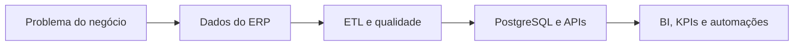

<div align="center">


[](https://git.io/typing-svg)

[](https://www.linkedin.com/in/eduardo-nogueira-campos/)
[](mailto:eduardo.nog77@gmail.com)
[](https://github.com/Eddev7)

</div>

## Sobre mim

Sou **Analista de Dados & Automação**, formado em **Análise e Desenvolvimento de Sistemas pela Faculdade SENAC**. Atuo transformando dados operacionais em informações confiáveis para o negócio e convertendo processos repetitivos em soluções automatizadas.

No dia a dia, trabalho da extração de dados em **ERP e IBM DB2** até a entrega de **pipelines ETL, bancos PostgreSQL, APIs, dashboards, KPIs e ferramentas internas**. Gosto de entender o problema por inteiro, desenhar a solução e colocá-la para funcionar em produção.

```python
eduardo = {
    "cargo": "Analista de Dados & Automação",
    "localizacao": "Maracanaú, CE — Brasil",
    "foco": ["Data Analytics", "BI", "ETL", "Automação de Processos"],
    "objetivo": "Transformar dados e processos em soluções que geram valor"
}
```

## O que eu construo

- **Pipelines de dados:** extração, transformação, validação e carga entre ERP, IBM DB2 e PostgreSQL.
- **Business Intelligence:** dashboards operacionais e gerenciais com KPIs para apoiar decisões.
- **Automação de processos:** rotinas em Python para eliminar tarefas manuais, reduzir erros e padronizar operações.
- **APIs e ferramentas internas:** soluções com FastAPI, Streamlit e SQLAlchemy integradas às regras do negócio.
- **Qualidade de dados:** conferências, tratamentos, regras de validação e monitoramento de informações críticas.

## Projetos e soluções

| Projeto | O que resolve | Tecnologias |
|:---|:---|:---|
| **Pipeline ERP → PostgreSQL → BI** | Centraliza dados operacionais e os prepara para análise e acompanhamento gerencial | Python, Pandas, IBM DB2, PostgreSQL, Docker |
| **Central de Business Intelligence** | Reúne indicadores de faturamento, balanço, quebras, transferências, consumo e operações | Streamlit, SQL, Pandas, Plotly |
| **Radar de documentos fiscais** | Monitora status, pendências e movimentações de notas fiscais | Python, SQL, PostgreSQL, Streamlit |
| **Automação de produtos e fornecedores** | Padroniza cadastros, associações e validações dentro dos processos do ERP | Python, Regex, Excel, IBM DB2 |
| **APIs e ferramentas internas** | Disponibiliza consultas, permissões e serviços de dados para uso interno | FastAPI, SQLAlchemy, PostgreSQL, Docker |

## Stack tecnológica

### Dados, análise e BI


### Bancos, backend e integração


### Engenharia e ambiente


## Como eu trabalho



> **Meu diferencial não é apenas executar tarefas: é entender o problema, estruturar os dados e entregar uma solução que continue gerando valor.**

## GitHub em números

<div align="center">


</div>

## Vamos conversar?

Estou aberto a conexões, troca de conhecimento e oportunidades em **Dados, BI, Engenharia de Dados e Automação de Processos**.

<div align="center">

**[LinkedIn](https://www.linkedin.com/in/eduardo-nogueira-campos/) • [E-mail](mailto:eduardo.nog77@gmail.com) • [GitHub](https://github.com/Eddev7)**


</div>
